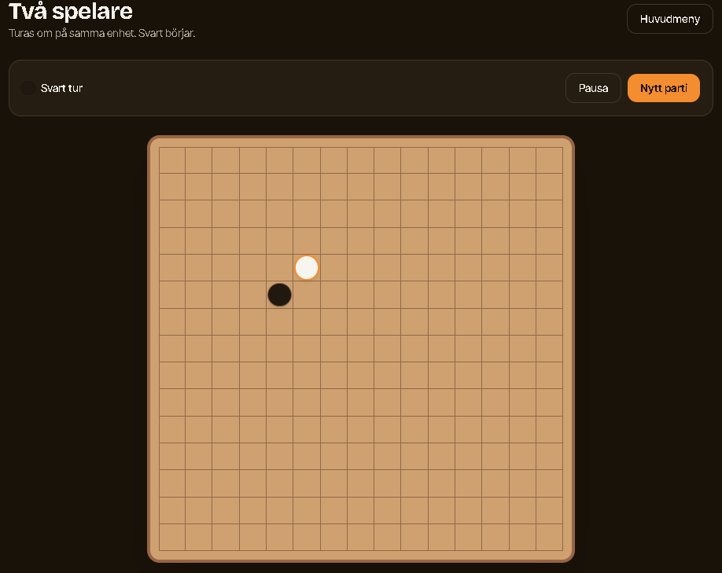

# Acceptanstester – Gomoku

**Testare:** Abdelmassih Ibrahim
**Datum:** 2026-09-14

## AC-01 – Starta spel

**Syfte:** Kontrollera att användaren kan starta ett spel utan konto.

**Test:**

1. Öppna Gomoku.
2. Välj "Mot datorn".
3. Starta ett nytt spel.
4. Lägg ett drag på spelplanen.

**Förväntat resultat:**
Spelet startar och användaren kan göra ett drag utan att skapa konto eller logga in.

**Resultat:** ☑ GODKÄND ☐ EJ GODKÄND

**Bevis:**

---

## AC-02 – Spela mot datorn

**Syfte:** Kontrollera att datorn kan spela mot användaren.

**Test:**

1. Starta "Mot datorn".
2. Gör ett drag.
3. Vänta på datorns drag.

**Förväntat resultat:**
Datorn gör automatiskt sitt drag och spelet fortsätter.

**Resultat:** ☑ GODKÄND ☐ EJ GODKÄND

**Bevis:** Lägg in skärmbild/video här.

---

## AC-03 – Svårighetsgrad

**Syfte:** Kontrollera att olika svårighetsgrader finns.

**Test:**

1. Starta ett spel mot datorn.
2. Kontrollera alternativen för svårighetsgrad.
3. Välj Easy, Medium och Hard.

**Förväntat resultat:**
Användaren kan välja mellan Easy, Medium och Hard.

**Resultat:** ☑ GODKÄND ☐ EJ GODKÄND

**Bevis:** Lägg in skärmbild här.

---

## AC-04 – Två spelare på samma plats

**Syfte:** Kontrollera att två personer kan spela på samma enhet.

**Test:**

1. Välj "Två spelare".
2. Spelare 1 gör ett drag.
3. Spelare 2 gör ett drag.
4. Fortsätt spela.

**Förväntat resultat:**
Spelarna turas om och kan göra lagliga drag.

**Resultat:** ☑ GODKÄND ☐ EJ GODKÄND

**Bevis:** Lägg in skärmbild här.

## AC-05 – Spela online via länk

**Syfte:** Kontrollera att två personer kan spela via en delad länk.

**Test:**

1. Skapa ett onlinespel.
2. Kopiera länken.
3. Öppna länken i en annan webbläsare/enhet.
4. Gör drag från båda spelarna.

**Förväntat resultat:**
Den andra spelaren kan ansluta via länken och båda spelarna ser samma spelplan.

**Resultat:** ☑ GODKÄND ☐ EJ GODKÄND

**Bevis:** Lägg in skärmbilder/video här.

## AC-06 – Vinst med fem i rad

**Syfte:** Kontrollera att spelet upptäcker en vinst.

**Test:**

1. Starta ett spel.
2. Lägg fem markeringar i rad horisontellt, vertikalt eller diagonalt.

**Förväntat resultat:**
Spelet upptäcker fem i rad, avslutar matchen och visar vinnaren.

**Resultat:** ☑ GODKÄND ☐ EJ GODKÄND

**Bevis:** Lägg in skärmbild här.

---

## AC-07 – Oavgjort spel

**Syfte:** Kontrollera att spelet kan sluta oavgjort.

**Test:**

1. Spela tills hela spelplanen är full utan att någon får fem i rad.

**Förväntat resultat:**
Spelet avslutas och visar att matchen blev oavgjord.

**Resultat:** ☑ GODKÄND ☐ EJ GODKÄND

**Bevis:** Lägg in skärmbild här.

## AC-08 – Förhindra ogiltiga drag

**Syfte:** Kontrollera att en upptagen ruta inte kan användas igen.

**Test:**

1. Lägg en markering på en ruta.
2. Försök lägga en ny markering på samma ruta.

**Förväntat resultat:**
Den första markeringen ligger kvar och den andra markeringen placeras inte där.

**Resultat:** ☑ GODKÄND ☐ EJ GODKÄND

**Bevis:** Lägg in skärmbild/video här.

## AC-09 – Spara och återuppta spel

**Syfte:** Kontrollera att ett pågående spel kan återupptas.

**Test:**

1. Starta ett spel.
2. Gör några drag.
3. Lämna spelet.
4. Öppna Gomoku igen.
5. Försök fortsätta spelet.

**Förväntat resultat:**
Det pågående spelet kan återupptas med tidigare drag kvar.

**Resultat:** ☑ GODKÄND ☐ EJ GODKÄND

**Bevis:** Lägg in före/efter-skärmbild här.

## AC-10 – Internetanslutning

**Syfte:** Kontrollera att ett online-spel kan fortsätta efter ett tillfälligt internetavbrott.

**Test:**

1. Starta ett onlinespel.
2. Gör några drag.
3. Stäng tillfälligt av internet.
4. Slå på internet igen.
5. Fortsätt spelet.

**Förväntat resultat:**
Matchen avslutas inte automatiskt och spelet kan fortsätta efter återanslutning.

**Resultat:** ☑ GODKÄND ☐ EJ GODKÄND

**Bevis:** Lägg in video/skärmbilder här.

---

## AC-11 – Mobil användning

**Syfte:** Kontrollera att spelet fungerar på mobil.

**Test:**

1. Öppna Gomoku på en mobil.
2. Starta ett spel.
3. Gör flera drag.

**Förväntat resultat:**
Spelplanen och knapparna fungerar och är användbara på mobilskärmen.

**Resultat:** ☑ GODKÄND ☐ EJ GODKÄND

**Bevis:** Lägg in skärmbild här.

## AC-12 – Ingen registrering

**Syfte:** Kontrollera att användaren kan spela utan konto.

**Test:**

1. Öppna Gomoku.
2. Starta ett spel.
3. Kontrollera att ingen registrering eller inloggning krävs.

**Förväntat resultat:**
Användaren kan spela utan konto eller personuppgifter.

**Resultat:** ☑ GODKÄND ☐ EJ GODKÄND

**Bevis:** Lägg in skärmbild här.

# Sammanfattning

| TestResultat             |                        |
| ------------------------ | ---------------------- |
| AC-01 Starta spel        | ☑ GODKÄND ☐ EJ GODKÄND |
| AC-02 Spela mot datorn   | ☑ GODKÄND ☐ EJ GODKÄND |
| AC-03 Svårighetsgrad     | ☑ GODKÄND ☐ EJ GODKÄND |
| AC-04 Två spelare        | ☑ GODKÄND ☐ EJ GODKÄND |
| AC-05 Online via länk    | ☑ GODKÄND ☐ EJ GODKÄND |
| AC-06 Fem i rad          | ☑ GODKÄND ☐ EJ GODKÄND |
| AC-07 Oavgjort           | ☑ GODKÄND ☐ EJ GODKÄND |
| AC-08 Ogiltiga drag      | ☑ GODKÄND ☐ EJ GODKÄND |
| AC-09 Återuppta spel     | ☑ GODKÄND ☐ EJ GODKÄND |
| AC-10 Internetavbrott    | ☑ GODKÄND ☐ EJ GODKÄND |
| AC-11 Mobil              | ☑ GODKÄND ☐ EJ GODKÄND |
| AC-12 Ingen registrering | ☑ GODKÄND ☐ EJ GODKÄND |
