```mermaid
flowchart TD

    A["Icke-funktionella krav för Gomoku"]

    A --> B["Systemets icke-funktionella krav"]

    B --> NFR01["NFR-01<br/>Användarvänlighet"]
    B --> NFR02["NFR-02<br/>Responsiv design"]
    B --> NFR03["NFR-03<br/>Prestanda"]
    B --> NFR04["NFR-04<br/>Anonym användning"]
    B --> NFR05["NFR-05<br/>Kompatibilitet"]
    B --> NFR06["NFR-06<br/>Anslutning via länk"]
    B --> NFR07["NFR-07<br/>Tillförlitlighet"]
    B --> NFR08["NFR-08<br/>Säkerhet och integritet"]
    B --> NFR09["NFR-09<br/>Visuell stabilitet"]
    B --> NFR10["NFR-10<br/>Konsekvent brädstatus"]

    A --> C["Internetavbrott"]

    C --> NFR11["NFR-11<br/>Tillfälligt internetavbrott ska inte automatiskt avsluta matchen"]
    C --> NFR12["NFR-12<br/>Senaste giltiga spelstatus, tillstånd och turordning återställs vid återanslutning"]

    A --> D["Anonymt spelande"]

    D --> NFR13["NFR-13<br/>Spelet fungerar direkt i webbläsaren utan installation"]
    D --> NFR14["NFR-14<br/>Spelet fungerar på datorer och mobiltelefoner"]

    NFR01 --> T01["Enkel att förstå och använda"]
    NFR02 --> T02["Anpassas till mobil och dator"]
    NFR03 --> T03["Snabb respons på spelarens drag"]
    NFR04 --> T04["Ingen registrering eller inloggning"]
    NFR05 --> T05["Fungerar direkt i webbläsaren"]
    NFR06 --> T06["Två spelare kan spela via länk"]
    NFR07 --> T07["Matchen förloras inte vid tillfälligt internetavbrott"]
    NFR08 --> T08["Ingen personlig information krävs"]
    NFR09 --> T09["Spelplanens storlek och position är oförändrad"]
    NFR10 --> T10["Samma brädstatus för båda spelarna"]

    NFR11 --> T11["Matchen fortsätter efter tillfälligt avbrott"]
    NFR12 --> T12["Matchens senaste giltiga tillstånd återställs"]

    NFR13 --> T13["Ingen programinstallation krävs"]
    NFR14 --> T14["Fungerar på både dator och mobil"]

    style A font-weight:bold
    style B font-weight:bold
    style C font-weight:bold
    style D font-weight:bold
```

# Icke-funktionella krav för Gomoku

Vilka egenskaper ett system behöver ha är väldigt viktigt för användarupplevelsen. Kraven är framtagna genom en intervju med kunden. Under intervjun ställdes frågor kring hur snabbt spelet ska fungera, vilka enheter kunden använder men även vad som händer om anslutningen till internet plötsligt försvinner.

# Systemets icke-funktionella krav:

| ID     | KRAV                                                                                                                                                                                                                                    |
| ------ | --------------------------------------------------------------------------------------------------------------------------------------------------------------------------------------------------------------------------------------- |
| NFR-01 | Användarvänlighet: Spelet ska vara enkelt att förstå och använda även för en person utan teknisk kunskap                                                                                                                                |
| NFR-02 | Responsiv design:	Spelplan, knappar och information ska fungera och anpassas till mobil och dator.                                                                                                                                      |
| NFR-03 | Prestanda: Efter att användaren klickar på en giltig position ska stenen visas inom 100 ms under normal användning.                                                                                                                     |
| NFR-04 | Anonym användning: Användaren ska kunna spela utan att skapa konto eller logga in.                                                                                                                                                      |
| NFR-05 | Kompatibilitet: Spelet ska fungera på mobil och dator direkt i webbläsaren utan installation.                                                                                                                                           |
| NFR-06 | Anslutning via länk: Två spelare ska kunna spela tillsammans från samma eller olika platser.                                                                                                                                            |
| NFR-07 | Tillförlitlighet: Spelet ska kunna hantera tillfälligt internetavbrott utan att matchen förloras                                                                                                                                        |
| NFR-08 | Säkerhet och integritet: Personlig information ska inte krävas för att spela och ska inte finnas i inbjudningslänken.                                                                                                                   |
| NFR-09 | Visuell/UI-stabilitet: Spelplanens storlek, position och även rutornas dimensioner ska fortsätta vara oförändrade när en sten placeras. Placera flera stenar och kontrollera att brädet inte krymper, flyttar sig eller ändrar storlek. |
| NFR-10 | Brädans tillstånd ska vara konsekvent för båda spelarna i en match som sker på distans.                                                                                                                                                 |

## BDD-förtydliganden

BDD används här för att förtydliga de icke-funktionella krav som vi tyckte var större eller innehåller flera olika olika beteenden. Alla krav har inte ett eget BDD-scenario för dem kanske var tydliga redan.

# NFR-01 – Användarvänlighet
```gherkin
Scenario 1: Användaren ska kunna förstå hur spelet används
- Givet: att användaren öppnar spelet
- När: användaren ska starta och spela en match
- Så: ska det vara tydligt hur spelet startas
- Och: ska det vara tydligt hur en sten placeras
- Och: ska det vara tydligt vems tur det är
- Och: användaren ska kunna förstå spelets grundläggande funktioner utan teknisk kunskap
```
# NFR-02 – Responsiv design
```gherkin
 Scenario 1: Spelet används på mobil
- Givet: att användaren öppnar spelet på en mobil
- När: spelplanen visas
- Så: ska spelplanen anpassas efter skärmens storlek
- Och: knappar ska fungera
- Och: information ska vara synlig
- Och: användaren ska kunna genomföra ett drag
```
```gherkin
### Scenario 2: Spelet används på dator
- Givet: att användaren öppnar spelet på en dator
- När: spelplanen visas
- Så: ska spelplanen anpassas efter skärmens storlek
- Och: knappar ska fungera
- Och: information ska vara synlig
- Och: användaren ska kunna genomföra ett drag
```

# NFR-05 – Kompatibilitet
```gherkin
 Scenario 1: Spelet öppnas direkt i webbläsaren
- Givet: att användaren använder en mobil eller dator
- När: användaren öppnar spelet i en webbläsare
- Så: ska spelet kunna användas direkt
- Och: användaren ska inte behöva installera något
```

# NFR-06 – Anslutning via länk
```gherkin
### Scenario 1: Två spelare spelar tillsammans via en länk
- Givet: att en spelare har skapat en match
- Och: att spelaren har en giltig spellänk
- När: en annan spelare öppnar länken
- Så: ska den andra spelaren kunna ansluta till samma match
- Och: båda spelarna ska kunna spela tillsammans
- Och: spelarna ska kunna befinna sig på samma eller olika platser
```

# NFR-07 – Tillförlitlighet
```gherkin
### Scenario 1: Matchen förloras inte vid tillfälligt internetavbrott

- Givet: att två spelare befinner sig i en pågående match
- När: en spelares internetanslutning tillfälligt bryts
- Så: ska matchen inte förloras
- Och: den senaste giltiga spelstatusen ska finnas kvar
- Och: spelaren ska kunna fortsätta matchen efter återanslutning
```


# NFR-08 – Säkerhet och integritet
```gherkin
### Scenario 1: Spelaren kan spela utan personlig information
- Givet: att användaren vill spela
- När: användaren startar eller ansluter till en match
- Så: ska personlig information inte krävas
- Och: användaren ska inte behöva skapa ett konto
- Och: användaren ska inte behöva logga in
```

```gherkin
### Scenario 2: Inbjudningslänken innehåller ingen personlig information
- Givet: att systemet har skapat en inbjudningslänk
- När: användaren delar länken
- Så: ska länken inte innehålla personlig information
- Och: länken ska kunna användas av den andra spelaren för att ansluta till matchen
```

```gherkin
# NFR-09 – Visuell/UI-stabilitet
 Scenario 1: En sten placeras på spelplanen
- Givet: att spelplanen visas
- När: användaren placerar en sten
- Så: ska spelplanens storlek vara oförändrad
- Och: spelplanens position ska vara oförändrad
- Och: rutornas dimensioner ska vara oförändrade
```
### Scenario 2: Flera stenar placeras på spelplanen
```gherkin
- Givet: att flera stenar redan finns på spelplanen
- När: användaren placerar ytterligare en sten
- Så: ska brädet inte krympa
- Och: brädet ska inte flytta sig
- Och: brädet ska inte ändra storlek
```


# NFR-10 – Brädans tillstånd
```gherkin
### Scenario 1: Samma brädstatus visas för båda spelarna
- Givet: att två spelare befinner sig i samma match
- Och: att båda spelarna är anslutna
- När: en spelare placerar en sten
- Så: ska stenen visas på samma position för båda spelarna
- Och: brädans tillstånd ska vara samma för båda spelarna
- Och: aktuell tur ska uppdateras
```
## Internetavbrott

| ID     | KRAV                                                                                                                                                                   |
| ------ | ---------------------------------------------------------------------------------------------------------------------------------------------------------------------- |
| NFR-11 | Ett tillfälligt internetavbrott ska inte automatiskt avsluta en pågående match som sker på distans mellan två spelare                                                  |
| NFR-12 | När spelaren återansluter ska systemet alltid återställa den senaste giltiga spelstatus, tillstånd och turordning. (Om motståndaren inte har valt att avsluta matchen) |

```gherkin
# NFR-11 – Tillfälligt internetavbrott
### Scenario 1: Matchen avslutas inte automatiskt vid internetavbrott
- Givet: att två spelare har en pågående match på distans
- När: en spelares internetanslutning tillfälligt bryts
- Så: ska matchen inte automatiskt avslutas
- Och: den senaste giltiga spelstatusen ska finnas kvar
- Och: matchen ska kunna fortsätta efter återanslutning
```
```gherkin
# NFR-12 – Återställning efter återanslutning
### Scenario 1: Matchen återställs efter återanslutning
- Givet: att två spelare har en pågående match på distans
- Och: att spelplanen innehåller flera placerade stenar
- Och: att en spelares internetanslutning har brutits
- Och: att motståndaren inte har avslutat matchen
- När: spelaren återansluter
- Så: ska den senaste giltiga spelstatusen återställas
- Och: spelplanens tillstånd ska återställas
- Och: rätt spelares tur ska visas
- Och: matchen ska kunna fortsättas
```
## Anonymt spelande
| ID     | KRAV                                                                                                       |
| ------ | ---------------------------------------------------------------------------------------------------------- |
| NFR-13 | Spelet ska alltid kunna användas direkt i en webbläsare utan att spelaren behöver installera något program |
| NFR-14 | Spelet ska kunna användas på både datorer och mobiltelefoner                                               |

```gherkin
# NFR-14 – Spelet fungerar på datorer och mobiltelefoner
 Scenario 1: Spelet används på dator
- Givet: att användaren använder en dator
- När: användaren öppnar spelet
- Så: ska spelet kunna användas
- Och: spelets funktioner ska vara tillgängliga
```
```gherkin
Scenario 2: Spelet används på mobiltelefon
- Givet: att användaren använder en mobiltelefon
- När: användaren öppnar spelet
- Så: ska spelet kunna användas
- Och: spelets funktioner ska vara tillgängliga
```


