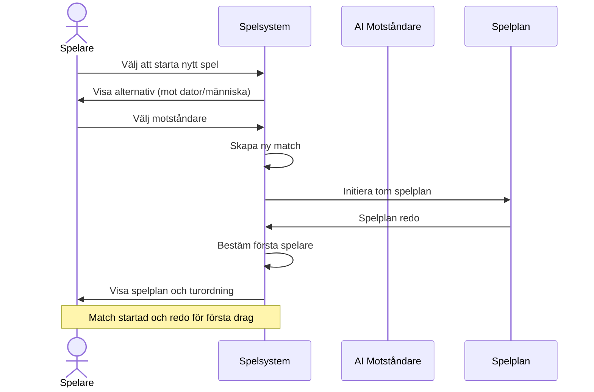
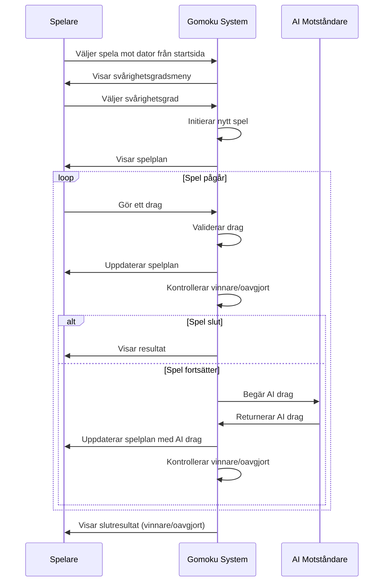
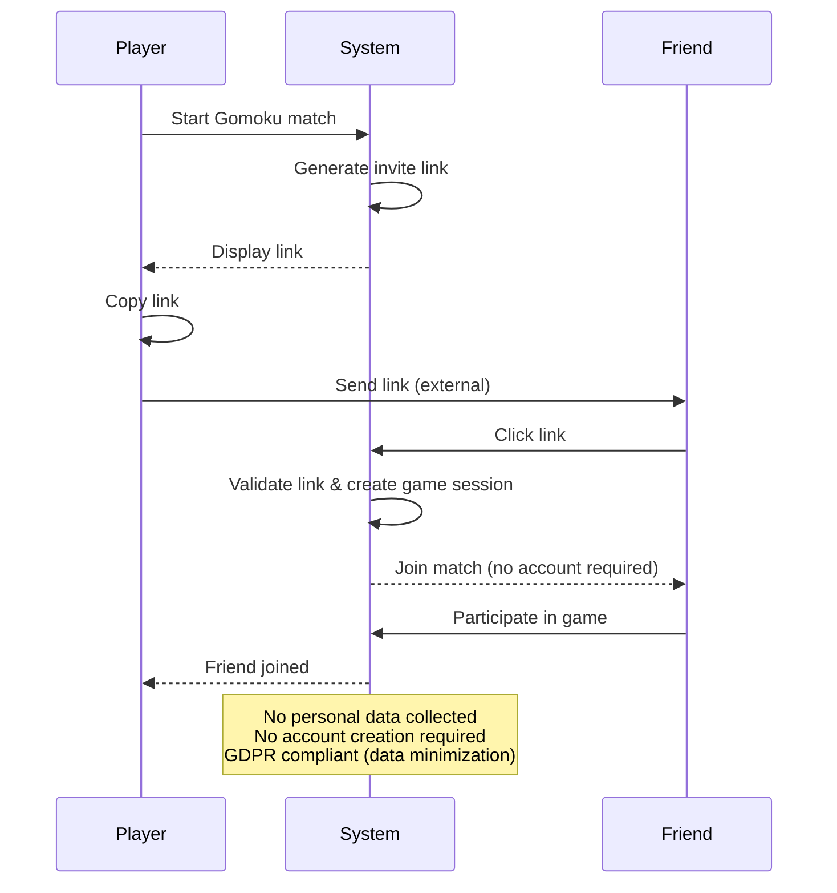

# 7 Use Cases Overview

## 7.1 Aktörer

| Aktör       		| Förkortning | Beskrivning                     |
|-----------------------|-------------|---------------------------------|
| Gäst användare  	| GU          | Användare utan befintligt konto |
| Registrerad användare | RU          | Inloggad användare på ett befintligt konto |
| Datorns AI            | AI          | Datorstyrd spelare |

## 7.2 Funktionella Use Cases

| UC-ID | Användningsfall namn | Primär aktör | Sekundär aktör | Relaterade FR |
|-------|----------------------|--------------|----------------|---------------|
| UC-01 | Starta en match | GU, RU | GU, RU, AI | FR-01.1, FR-01.2, FR-01.3, FR-01.4, FR-01.5 |
| UC-02 | Spel mot datorns AI | GU, RU | AI | FR-02.1, FR-02.4, FR-02.5, FR-02.6, FR-02.7, FR-02.8, FR-02.9, FR-02.10, FR-02.11, FR-02.12 |
| UC-06 | Bjud in vän via länk | GU, RU | GU, RU | FR-06.1, FR-06.2, FR-06.3, FR-06.4, FR-07.2, FR-07.3 |
| UC-07 | Anslut till match via länk | GU, RU | GU, RU | FR-06.5, FR-06.6, FR-06.9, FR-07.2 |
| UC-10 | Se matchresultat | GU, RU | GU, RU, AI | FR-10.1, FR-10.2, FR-10.3, FR-10.4, FR-10.5, FR-10.6, FR-10.7, FR-11.1, FR-11.2, FR-11.3, FR-11.4, FR-11.5 |
| UC-12 | Spela på samma plan som vän | GU, RU | GU, RU | FR-07.1, FR-07.2, FR-07.3, FR-07.4 |

## 7.2.1 Starta en match

### 7.2.2 Spel mot datorn

### 7.2.3 Bjud in vän via länk

## 7.3 Kompletterande Use Cases

| UC-ID | Användningsfall namn | Primär aktör | Sekundär aktör | Relaterade CR (står som FR) |
|-------|----------------------|--------------|----------------|-----------------------------|
| UC-03 | Välja svårighetsgrad | GU, RU | AI | FR-03.1, FR-03.2, FR-03.3 |
| UC-04 | Spela anonymt utan konto | GU | GU, RU, AI | FR-04.1, FR-04.2, FR-04.3, FR-04.4, FR-04.5, FR-04.6 |
| UC-05 | Hantera cookies | GU | finns ej | FR-05.1, FR-05.2, FR-05.3, FR-05.4, FR-05.5 |
| UC-09 | Återuppta sparad match | GU, RU | GU, RU, AI | FR-09.1, FR-09.2 |
| UC-11 | Fortsätta efter internetavbrott | GU, RU | GU, RU, AI | FR-08.1, FR-08.2 |

## 7.4 Icke-funktionella Use Cases

| UC-ID | Användningsfall namn | Primär aktör | Sekundär aktör | Relaterade NFR |
|-------|----------------------|--------------|----------------|----------------|
| UC-01 | Starta en match | GU, RU | GU, RU, AI | NFR-01, NFR-03 |
| UC-02 | Spel mot datorns AI | GU, RU | AI | NFR-01, NFR-03 |
| UC-03 | Välja svårighetsgrad | GU, RU | AI | NFR-01 |
| UC-04 | Spela anonymt utan konto | GU | GU, RU, AI | NFR-04, NFR-08 |
| UC-05 | Hantera cookies | GU | finns ej | NFR-05, NFR-08 |
| UC-06 | Bjud in vän via länk | GU, RU | GU, RU | NFR-06, NFR-08 |
| UC-07 | Anslut till match via länk | GU, RU | GU, RU | NFR-01, NFR-05, NFR-06, NFR-08 |
| UC-09 | Återuppta sparad match | GU, RU | GU, RU, AI | NFR-01, NFR-03 |
| UC-10 | Se matchresultat | GU, RU | GU, RU, AI | NFR-01, NFR-03, NFR-10 |
| UC-11 | Fortsätta efter internetavbrott | GU, RU | GU, RU, AI | NFR-03, NFR-07, NFR-08 |
| UC-12 | Spela på samma plan som vän | GU, RU | GU, RU | NFR-01, NFR-02 |

## 7.5 Use Case Priority Matrix

| Prioritet | Use Cases |
|-----------|-----------|
| Högst prioritet | UC-01, UC-02, UC-05, UC-06, UC-07, UC-10, UC-12  |
| Medelhög prioritet | UC-03, UC-04, UC-09, UC-11 |
| Lägre prioritet |  |

